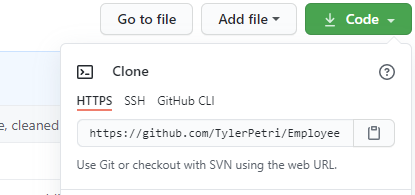

## Employee Tracker 2.0

## Description

An application to track employee information within a database. There are options such as: adding roles, adding managers, seeing the utilized budget per department, etc.

Before usage, be warned that if the database is empty, you will require to add a department and a role in that order to be able to add an employee (they are both necessary information)

Full usage walkthrough video below

## Table of Contents

- [Installation](#Installation)
- [Usage](#Usage)
- [Contributing](#Contributing)

## Installation

To download, click the green "code" button in the top right, and copy paste that link into git bash.

$git clone link

Once you've opened your folder, `npm init` to that folder

Then `npm install inquirer`

Repeat `npm install mysql` `npm install console-tables`

You now have the node modules necessary to complete the code

## Usage

## Contributing

There are many ways in which you can participate in the project, for example: 
* Submit bugs and feature requests to the email below, and help us verify as they are checked in 
* Review source code changes
* Review the documentation and make pull requests for anything from typos to new content

## Questions

For any additional questions see my [GitHub profile](http://github.com/tylerpetri) or contact tylerpetri@hotmail.com